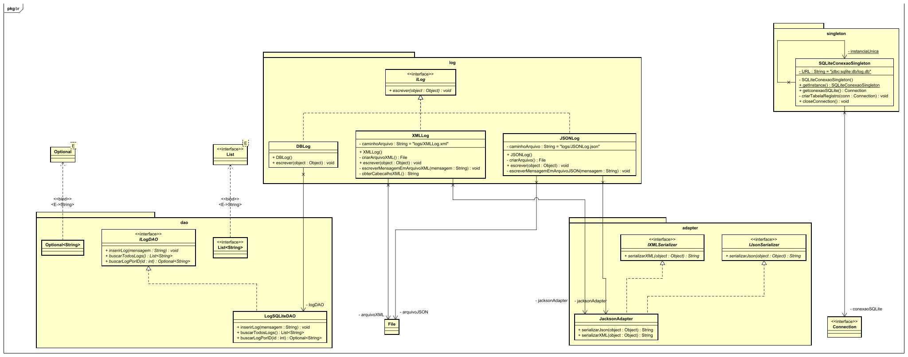

# loggingR

loggingR é um módulo externo de logging desenvolvido para aplicações Java, oferecendo uma solução eficiente e flexível para o registro de eventos e mensagens.

## 🎯 Características

- Simplicidade: Fácil de integrar e utilizar em projetos Java existentes.

- Flexibilidade: Permite configuração personalizada para atender às necessidades específicas de cada aplicação.

- Desempenho: Otimizado para minimizar o impacto no desempenho da aplicação.

## 🔧 Tecnologias


## 📐 Diagrama de classes

O diagrama de classes podem ser encontrado na pasta `/diagramaclasses` [(Clique aqui)](diagramaclasses/).



## 📋 Requisitos
- **Linguagem**: Java 17.
- **Gerenciador de Dependências**: Maven.

## 📦 Como importar utilizando o jitpack

[](https://jitpack.io/#Tetzdesen/loggingR)

### Projeto Maven

Adicione no arquivo pom.xml do seu projeto maven:

```
<repositories>
	<repository>
		  <id>jitpack.io</id>
		  <url>https://jitpack.io</url>
	</repository>
</repositories>

<dependency>
	  <groupId>com.github.Tetzdesen</groupId>
	  <artifactId>loggingR</artifactId>
	  <version>1.0.3</version>
</dependency>
```


